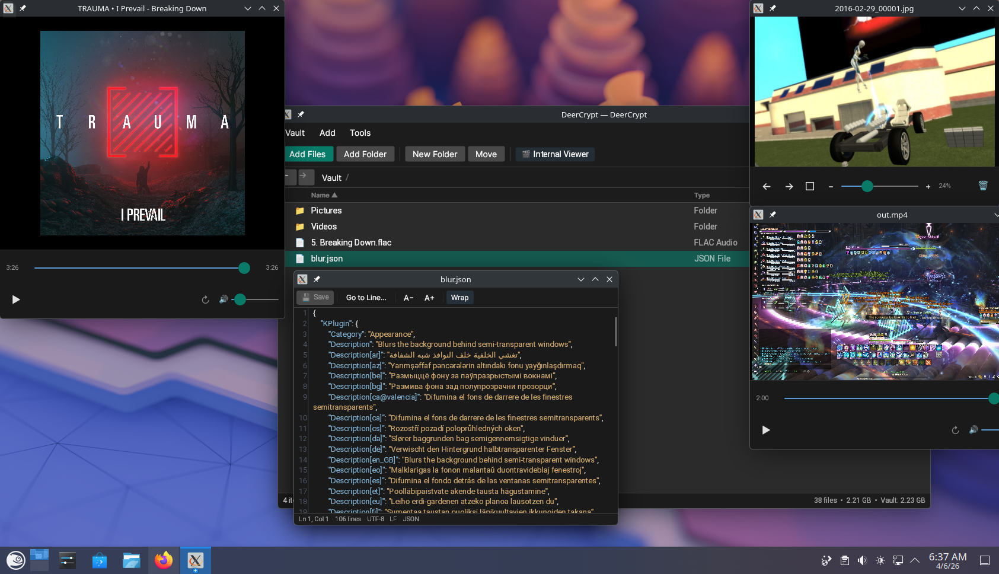

# DeerCrypt

[](../../releases/latest)
[](../../actions/workflows/dotnet-desktop.yml)
[](https://dotnet.microsoft.com/download/dotnet/10.0)
[](#installation)

Store your files in an encrypted vault accessible via password. View your files directly in the app without extracting - images, videos, audio, text, etc. Files will always remain in your control and will never be decrypted unless explicitly extracted.



---

## Features

- **In-app file viewers** - images, video, audio, and text/code files open automatically in-app. For other types, you pick how to open them: image viewer, media player, text editor, or just extract temporarily.
- **Text editor** - code highlighting support for over 100 different languages, markdown preview, auto-detects encoding and font size.
- **Media player** - using LibVLC, plays nearly any kind of media file. Shows album artwork for audio files.
- **Image viewer** - zoom (5%-800%), pan around, animated gifs, keyboard navigation between images.
- **File manager** - add, remove, rename, move, and extract files and folders. Drag & drop from Explorer.
- **Search** - live search with paths visible to see where they're from.
- **Navigation** - breadcrumb style with back/forward buttons.
- **Vault utilities** - compact (defragment and save space after deletions), integrity check, and password change.

---

## Installation

### Windows

1. Ensure you have the [.NET 10 Runtime](https://dotnet.microsoft.com/download/dotnet/10.0) installed.
2. Download the latest `win-x64` build from [Releases](../../releases).
3. Extract anywhere.
4. Run `DeerCrypt.exe`.

### Linux

1. Ensure you have the [.NET 10 Runtime](https://dotnet.microsoft.com/download/dotnet/10.0) installed.
2. Install **LibVLC 3**:
   ```bash
   # Debian/Ubuntu
   sudo apt install libvlc-dev

   # Fedora
   sudo dnf install vlc-devel

   # Arch
   sudo pacman -S vlc
   ```
3. Download the latest `linux-x64` build from [Releases](../../releases).
4. Extract:
   ```bash
   tar -xzf DeerCrypt-vX.X.X-linux-x64.tar.gz
   ```
5. Make executable and run:
   ```bash
   chmod +x DeerCrypt
   ./DeerCrypt
   ```

---

## Build from source

Requires [.NET 10 SDK](https://dotnet.microsoft.com/download/dotnet/10.0):

```bash
git clone https://github.com/SkylerGhostly/DeerCrypt
cd DeerCrypt
dotnet build
```

---

## Vaults

Your files reside inside self-contained `.dcv` files which can be moved, copied, backed up like regular files. The actual file content is broken into encrypted chunks and stored in the internal SQLite database. All chunks are encrypted with the same key - called master key - and master key itself is encrypted by a key which is generated based off your vault password.

- **Encryption Algorithm:** AES-256-GCM (authenticated encryption)
- **Key Derivation Scheme:** PBKDF2 with SHA512, 600,000 iterations and random salt for each vault.
- **Key Hierachy:** KEK/DEK (Key-Encrypted Key / Data-Encrypted Key). Password is used to generate key encryption key which protects master key.
- **Integrity Protection:** SHA-256 digest of file content.

---

## Notes

- **Password recovery is not possible.** There is no way to recover a password to any of your vaults, even by DeerCrypt itself. This is by design.
- **You cannot change your password.** For maximum security, your password is fundamentally tied to the foundation of the database and cannot be changed. If you need a new password, you must create a new vault and migrate your files.
- **Externally opened files** are stored temporarily on disk and cleaned up after vault exit. Consider avoiding this feature on shared/unsafe computers.
- **Vaults are not defragmented** by default. When files are removed, space is not freed up. Vault -> Compact command is needed.

---

## Disclaimer

There was no third party security auditing done. It implements known cryptographic primitives and schemes, but no independent evaluation was performed. Use it at your own discretion. 